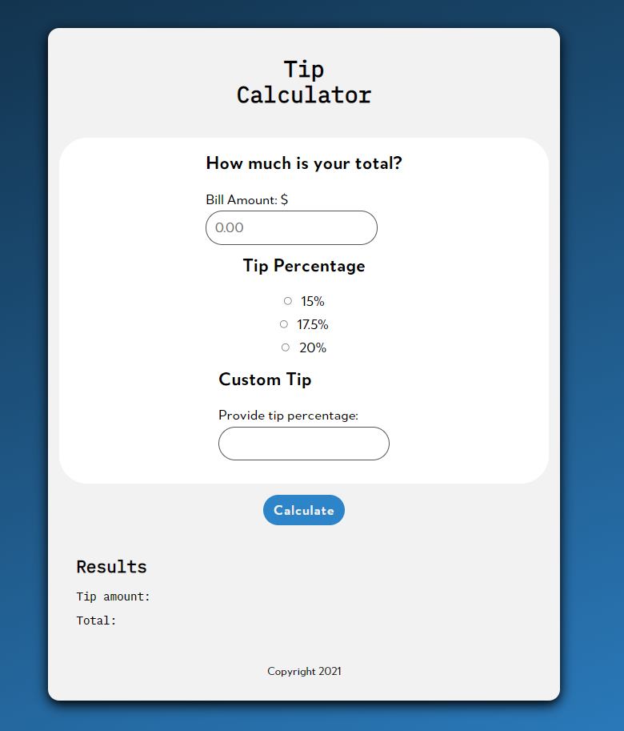

JavaScript Tip Calculator
===

First project

 
Course on LinkedIn Learning: __Build a Tip Calculator with Vanilla JavaScript__

## Project Goals:
- Semantic HTML
- Pass WAVE test
- Personal CSS styles
- Practice using Git and GitHub

### TODOs
- Run more tests on accessibility
- Better screenshot
